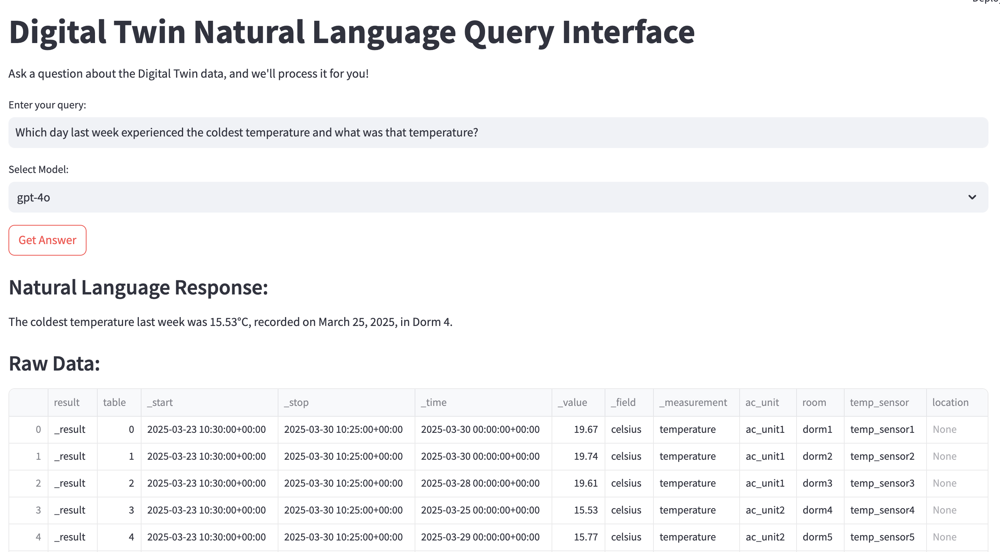
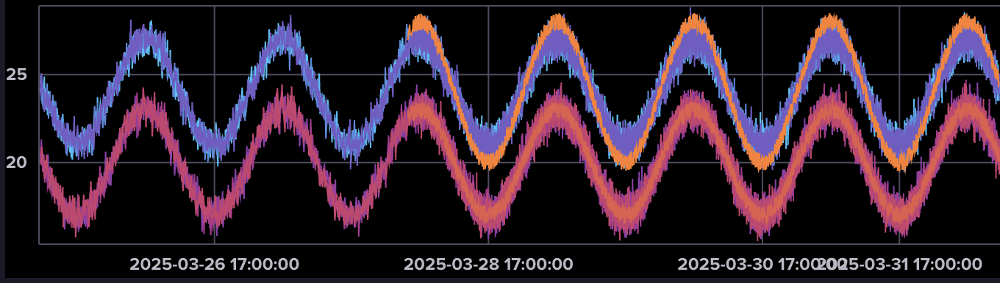
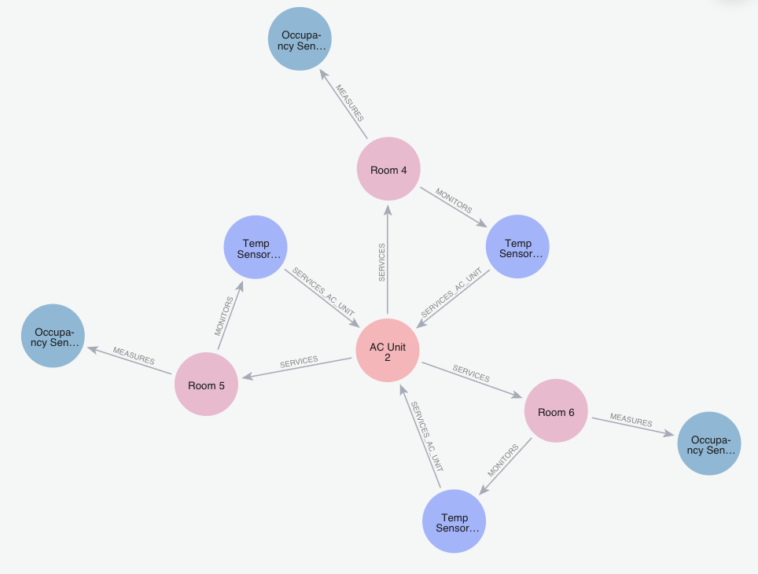

# Digital Twin Natural Language Query Interface

This project provides a natural language interface to query a digital twin of a building, leveraging both a graph database (Neo4j) for structural information and a time-series database (InfluxDB) for sensor data.



## Prerequisites

-   **Neo4j:** Graph database for structural data.
-   **InfluxDB:** Time-series database for sensor measurements.
-   **Python 3.x:** For running the query scripts and Streamlit UI.
-   **Streamlit:** For the interactive user interface.

## Setup


0. **Create New Data (optional):**
    You can create new sample data by running 
    ```python3 rooms_graph.py``` for the graph data
    and 
    ```python3 time_series.py``` for the time series data

2.  **Start Neo4j:**
    ```bash
    brew services start neo4j
    ```
    You can view the graph database at: [http://localhost:7474/browser/preview/](http://localhost:7474/browser/preview/)

3.  **Start InfluxDB:**
    ```bash
    brew services start influxdb
    ```
    You can explore the time-series data at: [http://localhost:8086/orgs/6405cc5d3c8be7e8/data-explorer?fluxScriptEditor](http://localhost:8086/orgs/6405cc5d3c8be7e8/data-explorer?fluxScriptEditor)

4.  **Run the Streamlit UI:**
    ```bash
    streamlit run ui.py
    ```
    Open the UI in your browser at: [http://localhost:8501/](http://localhost:8501/)

5.  **Run direct natural language queries (without UI):**
    ```bash
    python3 natural_language_query.py "How many rooms are there?"
    ```

## Database Details

### InfluxDB Time Series Database

The InfluxDB database stores all time-series sensor data collected from the building. This includes temperature readings and occupancy states over time. It is good for queries about sensor data, measurements, and time-based analysis.



#### Measurements:

-   **temperature**: Stores temperature readings in Celsius from temperature sensors.
-   **occupancy**: Stores occupancy states (0=unoccupied, 1=occupied) from occupancy sensors.

#### Temperature Measurement:

-   **Fields**: `celsius` (floating-point value representing temperature)
-   **Tags**:
    -   `ac_unit`: The AC unit associated with the room.
    -   `room`: The room where the temperature is measured.
    -   `temp_sensor`: The specific sensor reporting the temperature.

#### Occupancy Measurement:

-   **Fields**: `occupied` (binary value: 0=unoccupied, 1=occupied)
-   **Tags**:
    -   `ac_unit`: The AC unit associated with the room.
    -   `room`: The room where occupancy is detected.
    -   `occupancy_sensor`: The specific sensor reporting the occupancy.
    -   `room_type`: The type of room (e.g., "Dorm").

#### Time Range:

-   Data is available from 2025-03-23T10:30 to 2025-03-30T10:25.
-   Measurements are taken at 5-minute intervals.

#### Querying Guidelines

When answering questions, consider whether the information needed is:

1.  **Structural** (relationships between rooms and equipment) → Use Neo4j
2.  **Historical** (sensor readings over time) → Use InfluxDB
3.  **Combined** (requires information from both databases) → Join data from both sources

#### InfluxDB (Flux) Query Examples:

-   Get temperature readings for a specific room over the past day:
    ```flux
    from(bucket: "bucket")
    |> range(start: -1d)
    |> filter(fn: (r) => r._measurement == "temperature" and r.room == "dorm1")
    |> filter(fn: (r) => r._field == "celsius")
    ```
-   Find highest temperature readings across all rooms:
    ```flux
    from(bucket: "bucket")
    |> range(start: -7d)
    |> filter(fn: (r) => r._measurement == "temperature")
    |> filter(fn: (r) => r._field == "celsius")
    |> max()
    ```

### Neo4j Graph Database

The Neo4j database maintains the physical relationships between building components. It models how rooms, sensors, and equipment are connected to each other. It is good for queries about relationships, connections, and structural data.



#### Node Types:

-   **Room**: Represents a physical space in the building (dorm room or mechanical room).
-   **AirConditioningUnit**: Represents an HVAC unit that controls the temperature in dorm rooms.
-   **TemperatureSensor**: Devices that monitor the temperature in rooms.
-   **OccupancySensor**: Devices that detect whether rooms are occupied.

#### Relationship Types:

-   **SERVICES**: Connects an AC unit to the rooms it conditions.
-   **MONITORS**: Connects a room to its temperature sensor.
-   **MEASURES**: Connects a room to its occupancy sensor.
-   **SERVICES_AC_UNIT**: Connects temperature sensors back to the AC unit they inform.

#### Database Schema:
```
(AirConditioningUnit)-[SERVICES]->(Room)
(Room)-[MONITORS]->(TemperatureSensor)
(Room)-[MEASURES]->(OccupancySensor)
(TemperatureSensor)-[SERVICES_AC_UNIT]->(AirConditioningUnit)
```
#### Sample Data:

-   Rooms have properties: `name` (e.g., "Room 1") and `type` (e.g., "Dorm").
-   AC Units have property: `name` (e.g., "AC Unit 1").
-   Temperature Sensors have property: `label` (e.g., "Temp Sensor 1").
-   Occupancy Sensors have property: `label` (e.g., "Occupancy Sensor 1").

#### Neo4j (Cypher) Query Examples:

-   Find rooms serviced by a specific AC unit:
    ```cypher
    MATCH (ac {name: "AC Unit 1"})-[]->(room)
    RETURN room.name, room.type
    ```
-   Find sensors connected to a specific room:
    ```cypher
    MATCH (room {name: "Room 1"})-[]->(temp)
    MATCH (room)-[]->(occ)
    RETURN room.name, temp.label, occ.label
    ```
